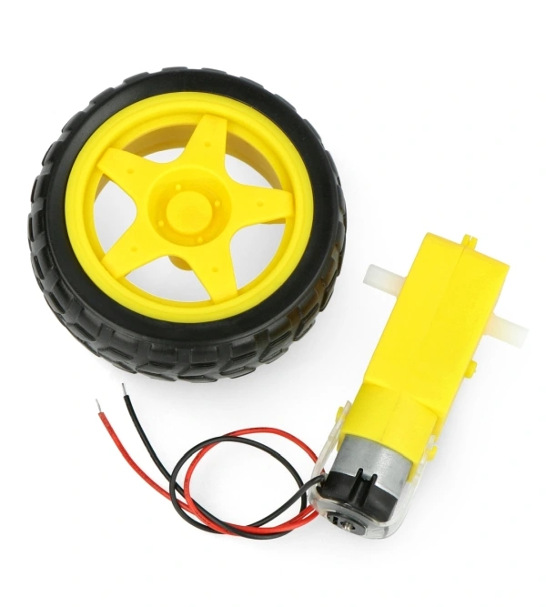

# PZSP2 - Robot

**Autorzy:**

- Wojciech Sekuła

- Kacper Tomczykowski

- Bartosz Pawlak

## Table of Contents

- [Wprowadzenie](#wprowadzenie)
- [Cel projektu](#cel-projektu)
- [Wstępna wizja projektu](#wstępna-wizja-projektu)
- [Komponenty projektu](#komponenty-projektu)
  - [HM-10](#hm-10)
    - [Opis](#opis)
    - [Połączenie i Komunikacja](#połączenie-i-komunikacja)
    - [Zasilanie i pobór prądu](#zasilanie-i-pobór-prądu)
    - [Protokół Komunikacyjny](#protokol-komunikacyjny)
  - [LD19 LiDAR](#ld19-lidar)
    - [Opis](#opis-1)
    - [Polaczenie i komunikacja](#polaczenie-i-komunikacja)
    - [Zasilanie i pobór prądu](#zasilanie-i-pobór-prądu-1)
  - [STM32 Nucleo-L476RG](#stm32-nucleo-l476rg)
    - [Opis](#opis-2)
    - [Polaczenie i komunikacja](#polaczenie-i-komunikacja-1)
  - [Pozostałe](#pozostałe)
- [RIOT OS](#riot-os)
  - [Opis](#opis-3)
  - [Pobieranie i Uruchomienie](#pobieranie-i-uruchmienie)
  - [Korzystanie](#korzystanie)
- [Organizacja pracy zespołowej (role w projekcie, narzędzia)](#organizacja-pracy-zespołowej-role-w-projekcie-narzędzia)
- [Analiza wymagań](#analiza-wymagań)
- [Architektura rozwiązania](#architektura-rozwiązania)
  - [Zastosowane szablony architektoniczne](#zastosowane-szablony-architektoniczne)
  - [Diagram Komponentow](#diagram-komponentow)
- [Projekt i implementacja](#projekt-i-implementacja)
- [Warstwa prezentacji / interfejs użytkownika](#warstwa-prezentacji--interfejs-użytkownika)
- [Wirtualizacja/konteneryzacja](#wirtualizacjakonteneryzacja)
- [Bezpieczeństwo](#bezpieczeństwo)
- [Podręcznik użytkownika](#podręcznik-użytkownika)
- [Podręcznik administratora](#podręcznik-administratora)
- [Podsumowanie](#podsumowanie)
- [Możliwe kierunki rozwoju](#możliwe-kierunki-rozwoju)

## Wprowadzenie

System składa się z zbudowanego Robota w semestrze 2023L przez zespół prowadzony
przez dr hab. inż. Krzysztofa Cabaja. Zadaniem naszego zespołu jest rozszerzenie
obota o moduł komunikacji bezprzewodowej oraz lidar. Robot składa się z
platformy, mikrokontrolera, dwóch silników zintegrowanych z kołami,
dwóch ultradźwiękowych czujników odległości oraz zasilania akumulatorowego.
Oprogramowanie pisane jest na platformę z systemem RIOT OS - Wielowątkowy system
operacyjny czasu rzeczywistego do urządzeń IoT.
W niniejszej dokumentacji skupiamy się na elementach dotyczących implementacji
naszych funcjonalności to jest na lidarze oraz komunikacji bezprzewodowej.
Pozostałe elementy robota będą opisane w minimalnym stopniu.

## Cel projektu

Celem niniejszego projektu jest opracowanie systemu umożliwiającego automatyczne
mapowanie pomieszczeń przy wykorzystaniu robota mobilnego oraz dedykowanego
oprogramowania wizualizującego na przenośnym komputerze. Projekt skupia
się na rozszerzeniu funkcjonalności istniejącego robota poprzez
dodanie Lidaru w celu uzyskania dokładniejszych informacji o odległości
od przeszkód. Całość systemu będzie komunikować się za pomocą modułu
bluetooth, co umożliwi zbieranie danych z robota i ich wizualizację.

## Wstępna wizja projektu

Wizja projektu obejmuje stworzenie kompleksowego systemu, który pozwoli
na skuteczne mapowanie pomieszczeń w sposób precyzyjny i efektywny.
Robot mobilny będzie wykorzystywał Lidar do zbierania danych o otaczającym
środowisku, a następnie przesyłał je do dedykowanego oprogramowania
wizualizacyjnego na komputerze. Program na komputerze będzie analizował
dane na podstawie, których będzie tworzył wizualizację. Na podstawie analizy danych, do robota
będą przesyłane komendy w celu skorygowania trasy ruchu.

## Komponenty projektu

Projekt robota składa się z następujacych części:

- Moduł Nucleo z 32-bitowym mikrokontrolerem STM32L476RG (<https://www.st.com/en/evaluation-tools/nucleo-l476rg.html>)
- Podwozie robota Chassis Rectangle 2WD
- 2x Ultradźwiękowy czujnik odległości HC-SR04
- Dwukanałowy sterownik silników DC Cytron Maker Drive MX1508
- Moduł Bluetooth HM-10
- Lidar D300 LiDAR Kit (<https://www.ldrobot.com/ProductDetails?sensor_name=D300+Kit>)

 

### HM-10

#### Opis

HM-10 to moduł Bluetooth 4.0 Low Energy (BLE) wykorzystywany do komunikacji
bezprzewodowej między urządzeniami. Jest często używany do zestawów IoT,
prototypowania urządzeń przenośnych i innych zastosowań, które wymagają
niskiego poboru energii i komunikacji na krótkim zasięgu.

#### Połączenie i komunikacja

Z modułem komunikujemy się za pomocą interfejsu UART przy pomocy komend AT.
Moduł jest skonfiguany w taki sposób, że wszystkie dane które prześlemy do niego
z mikrokontrolera przesyła do podłączonego urządzenia (tak samo w drugą stronę).
Jeżeli chcemy przesyłać do moduły komendy AT należy najpierw odłączyć
wszelkie urządzenia połaczone z modułem.

Konfiguracja:

- Interfejs: UART3 - UART_DEV(1)
- Baudrate: 115200
- PIN RX: PC_11
- PIN TX: PC_10

#### Zasilanie i Pobór prądu

- Input voltage = 3.3V - 5V
- Starting current = 20 mA
- Working current = 20 mA

#### Protokol komunikacyjny

Z robotem możemy komunikować się za pomocą dedykowanych komend poprzez wysyłanie ich do modułu bluetooth. Komendy powinny kończyć się sekwencją CRLF. Poniżej tabela z przedstawionymi aktualnie wspieranymi komendami.

| Komenda           | Opis                                               | Przykładowe użycie                                      | Odpowiedź robota       |
|------------------------------|-----------------------------------|-------------------------------------------|------------------------|
| RUN              | Uruchamia silniki z określoną mocą i kierunkiem    | RUN \<moc> \<kierunek>                                  | OK - RUN               |
| STOP          | Zatrzymuje silniki                                 | STOP                                                     | OK - STOP              |
| TURN          | Obraca silniki o określoną liczbę stopni i moc    | TURN \<stopnie> \<moc>                                   | OK - TURN              |
| RUNTIMED     | Uruchamia silniki na określony czas z mocą i kierunkiem | RUNTIMED \<moc> \<kierunek> \<czas_ms>               | OK - RUNTIMED          |
| LIDAR_START   | Rozpoczyna odbieranie danych z Lidaru              | LIDAR_START                                              | OK - LIDAR_START       |
| LIDAR_STOP    | Zatrzymuje odbieranie danych z Lidaru              | LIDAR_STOP                                               | OK - LIDAR_STOP        |
| CHECK_CONNECTION  | Sprawdza połączenie z urządzeniem                 | CHECK_CONNECTION                                         | OK                     |
| CHECK_PARAMS | Sprawdza parametry przekazane w komendzie          | CHECK_PARAMS \<param1> \<param2>                         | PARAM1 = \<param1> PARAM2 = \<param2> OK     |

### LD19 Lidar

#### Opis

LD19 Lidar Kit to zaawansowany czujnik odległości wykorzystujący technologię
laserową do dokładnego pomiaru odległości od obiektów w otoczeniu oraz kąta. Jest często
stosowany w aplikacjach związanych z robotyką, mapowaniem środowiska,
autonomicznymi pojazdami i innymi zastosowaniami wymagającymi precyzyjnego
pomiaru odległości.

#### Polaczenie i komunikacja

Moduł LD19 Lidar Kit komunikuje się poprzez interfejs szeregowy UART.
Odrazu po połączeniu lidar generuje i wysyła dane na linii RX.

Konfiguracja:

- Interfejs: UART1 - UART_DEV(2)
- Baudrate: 230400
- Pin RX: PA_10
- Pin TX: PA_9

#### Zasilanie i Pobór prądu

- Input voltage = 4.5V - 5.5V
- Starting current = 300 mA
- Working current = 180 mA

### Obsługa i dane

Lidar od razu po uruchomieniu zaczyna generować dane. Jeden pakiet danych
powinien mieć 47 bajtów i składać się z :

- 1 bajt header fixed at 0x54
- 1 bajt VerLen fixed at 0x2C
- 2 bajty określające prędkość lidaru
- 2 bajty określające kąt początkowy
- 11 razy 2 bajty pomiarów odległości i 1 bajt intensywność pomiaru
- 2 bajty określające kąt końcowy
- 2 bajty określające czas
- 1 bajt CRC check

Dokładniejsze dane można uzyskać w rozdzial trzecim "LiDAR Sensor LD19
Development Manual”. Z naszych obserwacji niestety wynika, że około 27%
pakietów jest uszkodzonych.

### STM32 Nucleo-L476RG

#### Opis

STM32 Nucleo-L476RG to płyta ewaluacyjna oparta na mikrokontrolerze STM32L476RG
z rodziny STM32. Jest wyposażona w różnorodne interfejsy komunikacyjne, złącza
GPIO i wiele innych funkcji, co czyni ją idealnym narzędziem do prototypowania
systemów wbudowanych, IoT i innych aplikacji. Płytka uruchamiana jest pod kontrolą
RIOT OS. Interfejsy takie jak UART, SPI, I2C, USB, co umożliwia integrację z różnymi urządzeniami i
modułami. Komunikacja z płytką może odbywać się poprzez interfejsy szeregowe,
interfejsy magistrali danych lub interfejsy USB w zależności od potrzeb projektu.

#### Polaczenie i komunikacja

Interfejs UART2 płytki jest połączony z wyjściem mini-usb,
dzięki czemu możliwe jest podglądanie i komunikacja z płytką po podłączeniu do PC.
Domyślny Baudrate wynosi 115200.

Płytka działa w 2 trybach zasilania - Bateryjnego oraz z portu mini-usb.
Aby przełączać się pomiedzy tymi trybami należy zmieniać położenie złączki
na piny jak na poniższym obrazku.

### Pozostałe

#### Cytron Maker Drive MX1508

Prosty w obsłudze, dwukanałowy sterownik silników DC, wyposażony w mostek H.

- Napięcie zasilnia: od 2,5 V do 9,5 V
- Napięcie wyjściowe: 5 V
- Prąd wyjściowy: 200 mA
- Prąd ciągły: 1 A
- Prąd chwilowy: 1,5 A
- Ilość kanałów: 2

#### 2x Koło + silnik 65x26mm 5V

Koło z oponą o średnicy 65 mm i szerokości 26 mm wraz z silnikiem zasilanym
napięciem 5 V, o poborze prądu ok. 180 mA. Silnik posiada przekładnię 48:1,
prędkość obrotowa to ok. 80 obr/min, moment wynosi 0,5 kg*cm. Do wyprowadzeń
silnika zostały dolutowane przewody.

- Napięcie zasilania: 5 V
- Pobór prądu: ok. 180 mA

#### Zasilanie

Robot zasilany jest przez 4 akumulatory AA o napięciu 1.2V i pojemności 2600 mA
połączone szeregowo.

## RIOT OS

### Opis

RIOT OS to system operacyjny typu open-source, zaprojektowany specjalnie dla
Internetu Rzeczy (IoT) i systemów wbudowanych. Jest on lekki, energooszczędny,
oraz zapewnia wsparcie dla wielu różnych platform sprzętowych, w tym dla
płytek Nucleo, takich jak Nucleo L476RG.

### Pobieranie i uruchmienie

Aby uzyć RIOT OS z tym projektem należy pobrać go  z repozytorium:
<https://github.com/RIOT-OS/RIOT.git> a następnie dodać do Makefile ścieżkę
do folderu RIOT: `RIOTBASE ?= path/to/RIOT`.
Alternatywą do tego jest użycie skryptu getRiot.sh który automatycznie pobiera
RIOT OS, zmienia Makefile'a i instaluje potrzebne pakiety do kompilacji.

### Korzystanie

Plik w którym znajdują się inicjację urządzen peryferyjnych
(PINOUT dla interfejsów SPI, UART, I2C...) znajduje się pod ścieżką:
`RIOT/boards/<dana płytka>/include/periph_conf.h`.

Przykłady kodu znajdują się w katalogu `/RIOT/tests/periph`

## Obróbka danych z LD19 Lidar na module Nucleo

### Opis

Wstępna obróbka danych zachodzi na płytce STM32 Nucleo-L476RG. Za pomocą
programu napisanego w C++, zostawiamyn kąt początkowy zapisany na 2 pierszych
bajtach oraz 12 odległości, zapisanych na 24 bajtach.

## Obróbka odebranych danych na komputerze

### Opis

Dane przesłane na komputer są agregowane do tablicy kątów, gdzie przechowywane
jest 360 pomiarów odległości. Dane odbierane zawierają często błędy oraz braki,
dlatego dane zbierane są z kilku pełnych obrotów lidara. Odległość dla
odpowiedniego kąta jest przechowywana w tablicy w postaci `tablica[kąt]`, gdzie
odpowiedni index oznacza kąt pomiaru. Dzieki wykonaniu kilku obrotów lidara
pomimo błędów w części danych udało się uzyskać kompletną tablicę odległości.

Odległości wyświetlane są za pomocą biblioteki 'matplotlib' na układzie
kartezjańskim. Współrzędne odpowiadające pomiarowi są obliczane za pomocą
biblioteki `numpy` i funkcji `np.sin`, `np.cos`.

## Organizacja pracy zespołowej (role w projekcie, narzędzia)

W ramach projektu zespół będzie składać się z członków odpowiedzialnych za
różne obszary działania:

- Programiści: odpowiedzialni za implementację algorytmów sterowania robotem
oraz oprogramowania wizualizującego.
- Inżynierowie sprzętu: zajmujący się integracją Lidaru z istniejącym robotem mobilnym.
- Analitycy: odpowiedzialni za analizę wymagań użytkownika i biznesowych
oraz przeprowadzenie testów funkcjonalnych.
- Koordynator projektu: monitorujący postępy prac i zapewniający koordynację
 działań pomiędzy poszczególnymi członkami zespołu.
Do zarządzania projektem oraz komunikacji wewnątrz zespołu zostaną wykorzystane
narzędzia do zarządzania projektem (Jira) oraz komunikator internetowy
(discord i messenger).

## Analiza wymagań

Wymagania użytkownika i biznesowe:

- Robot będzie jeździć po pomieszczeniu z zachowaniem podstawowej nawigacji.
- Robot będzie komunikować się bezprzewodowo z komputerem.
- Mikrokontroler będzie komunikować się z lidarem.
- Program na komputerze będzie analizował dane z lidaru.
- Program na komputerze będzie tworzył korekty do toru ruchu lidaru.
- System będzie generować mapę pomieszczenia w miarę poruszania się po nim.

## Architektura rozwiązania

### Zastosowane szablony architektoniczne

W projekcie zostanie zastosowany szablon architektoniczny oparty na
architekturze warstwowej. Architektura ta pozwoli na klarowne oddzielenie
poszczególnych warstw funkcjonalności systemu, co ułatwi zarządzanie,
rozwój i utrzymanie aplikacji.

- Warstwa prezentacji (interfejs użytkownika): Ta warstwa będzie odpowiedzialna
za prezentację danych użytkownikowi oraz interakcję z nim.
Będzie zawierać interfejs graficzny umożliwiający wizualizację mapy pomieszczenia.
- Warstwa logiki biznesowej: W tej warstwie znajdować się będzie główna
logika biznesowa aplikacji, która będzie odpowiedzialna za przetwarzanie
danych, zarządzanie nimi oraz implementację algorytmów związanych z mapowaniem pomieszczeń.
- Warstwa dostępu do danych: Ta warstwa będzie odpowiedzialna za komunikację
z zewnętrznymi źródłami danych, takimi jak dane otrzymywane z Lidaru
czy sterowanie robotem. Zapewni ona izolację od konkretnych źródeł danych i
umożliwi łatwe rozszerzanie systemu o nowe funkcjonalności.

### Diagram komponentow

#### Diagram klas z dostarczonego rozwiązania poprzedniego zespołu 

#### Diagram klas obecnie wykorzystywanych w projekcie

## Projekt i implementacja

- Odnośnik do repozytorium kodu: [Repozytorium](https://gitlab-stud.elka.pw.edu.pl/wsekula/pzsp2_robot)
- Lista języków programowania, bibliotek i środowisk:
  - Języki programowania użyte w projekcie to: Python, C++, Shell
  - Biblioteki C++: thread, xtimer
  - Biblioteki Python: ble-serial, subprocess
- Statystyki:
  - liczba plików: 24
  - linie kodu: 2497
  - z uwagi na charakter projektu IoT nie ma zaimplementowanych testów jednostkowych.

## Warstwa prezentacji / interfejs użytkownika

Zgodnie z ustaleniami z ekspertem od UX. W naszym projekcie występuje tylko
jeden widok dla użytkownika, dodatkowo bardzo prosty. Dlatego ta część
dokumentacji zostaje pominięta.

## Bazy danych

W projekcie nie będą przechowywane żadne dane trwałe. Nie ma potrzeby tworzenia
bazy danych. Dlatego ta część dokumentacji zostaje pominięta.

## Podsumowanie

Projekt polega na rozwoju robota mobilnego, który dzięki integracji z modułem
Lidar oraz komunikacją Bluetooth, zdolny jest do automatycznego mapowania
pomieszczeń. Oprogramowanie robota oparte jest na RIOT OS, co zapewnia efektywne
zarządzanie zasobami w czasie rzeczywistym. Rozwój systemu obejmuje
implementację algorytmów nawigacyjnych, przetwarzanie danych z Lidara,
a także rozwój interfejsu użytkownika dla wizualizacji danych. Projekt
skupia się na rozszerzeniu funkcjonalności robota i optymalizacji jego
pracy, co ma na celu stworzenie zaawansowanego narzędzia do mapowania
i monitorowania przestrzeni.

## Możliwe kierunki rozwoju

1. Rozszerzenie możliwości Lidara:

- Implementacja zaawansowanych algorytmów przetwarzania sygnału do filtracji
i korekty błędów w danych pochodzących z Lidara.

- Rozwój funkcjonalności rozpoznawania obiektów i klasyfikacji przeszkód na
podstawie zebranych danych.

2. Rozwój funkcji autonomicznego działania:

- Implementacja algorytmów SLAM (Simultaneous Localization and Mapping)
dla bardziej zaawansowanej nawigacji i mapowania w czasie rzeczywistym.

- Rozwój strategii i algorytmów planowania trasy oraz unikania przeszkód.

3. Interfejs użytkownika i wizualizacja danych:

- Rozwój zaawansowanego interfejsu graficznego (GUI)
na komputerze do wizualizacji danych i zarządzania robotem.

- Integracja z aplikacjami mobilnymi umożliwiającymi sterowanie robotem i odbiór
danych w czasie rzeczywistym.
